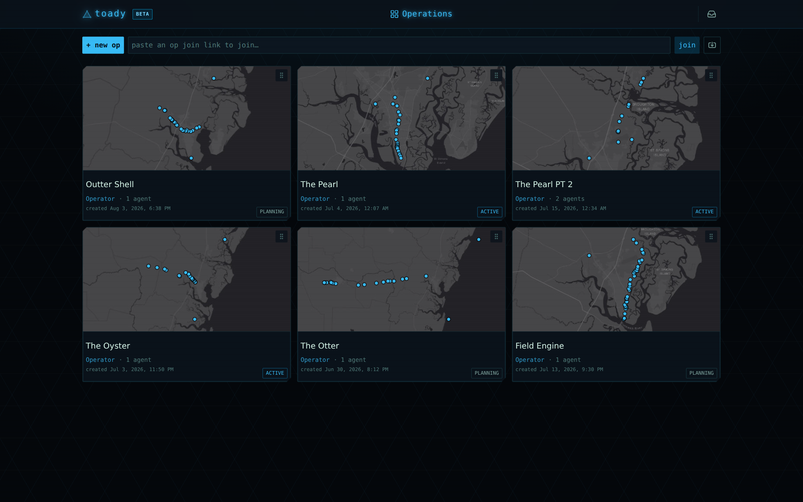
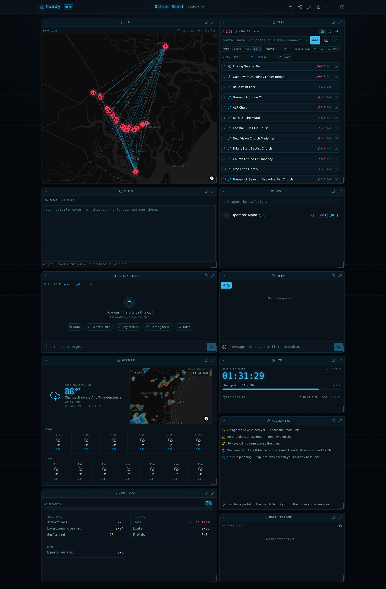
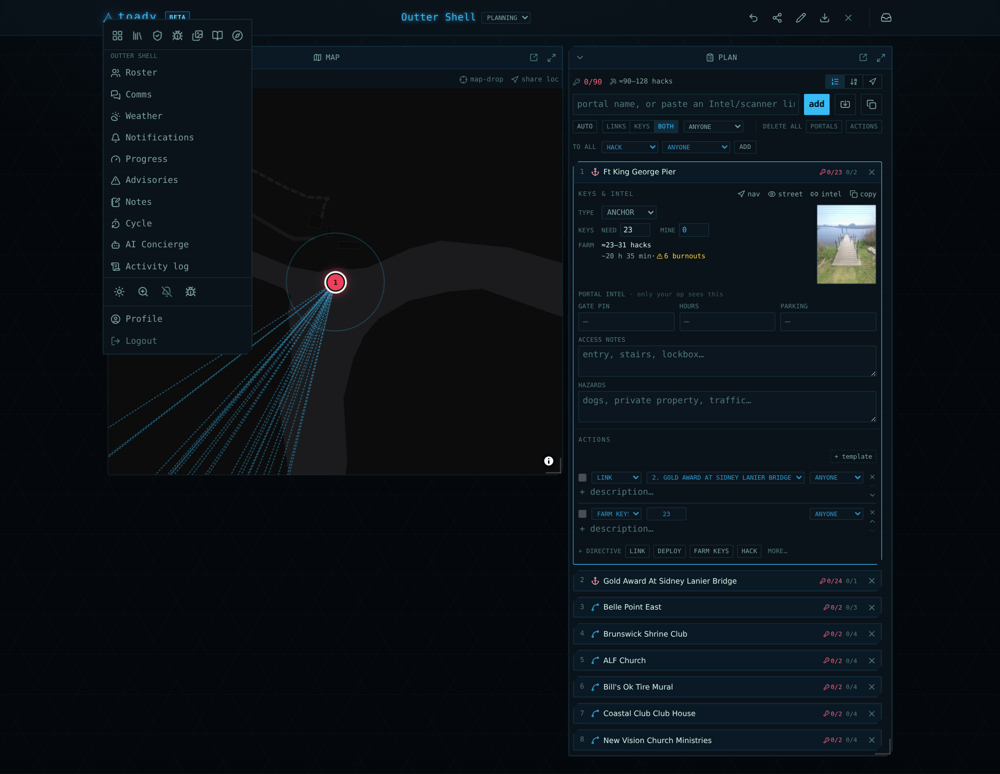
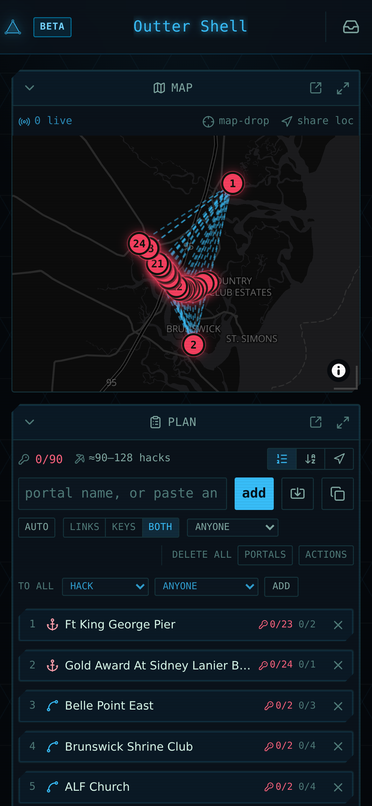

# toady

**An ephemeral, op-centric mission-command web app for Ingress field ops.**

toady is a multiplayer, much-more-elaborate take on Niantic's Mission Creator: an
operator builds an op — ordered (or any-order) **waypoints**, each with **directives**
(hack, deploy, link, mod, farm keys…) — shares a join link, and runs it live with a
real-time map, comms, fielding math, and field intel. No approval gate, **ephemeral by
default** (an op's data is purged when it closes), and plans are **exportable**.

## Highlights

- **Two roles** — an **Operator** builds and runs the op; **Agents** join via a shared link and execute.
- **Mission builder** — waypoints from a master catalog, a typed name, a pasted Intel/Maps link, or a
  bulk **IITC** field-plan import (Draw Tools / Bookmarks). Directives carry an objective, an optional
  second field (link target, mod, or key count), an assignee, and a description. Save a location's
  directives as a reusable **template**.
- **Live ops** — MapLibre map with agent positions, planned links, satellite/radar/route/traffic
  layers, NWS weather, and golden-hour times. Op chat with `@mentions`, 1:1 DMs, a roster with
  tap-to-contact, key tracking with shortfall, and **Progress** / **Advisories** dashboard widgets.
- **No websockets** — light **polling** sync (~3s) plus in-app banners (with optional phone buzz) and
  background **Web Push** (VAPID). Per-type notification preferences.
- **Customizable dashboard** — drag, resize, collapse, and add widgets; layouts persist per user.
- **Ephemeral & private** — closing an op purges every byte of it (FK cascade). Optional account-save
  persists only your profile and saved plan templates.

## Screenshots

### The op board
Every op you run or have joined — each card a live map thumbnail of its waypoints, with your role,
the agent count, and status. Drag to reorder; the order is saved per user.



### Running an op — the mission-command dashboard
A single op open in the operator's customizable dashboard. The **map** shows the plan's portals with
the auto-planned **fan links** drawn between them; the **plan** lists every waypoint with its directives,
key/hack counts, and the bulk "to all" composer. Around them: weather + doppler radar, the roster,
comms, an AI concierge, the cycle timer, live advisories, and a progress readout — every widget
drag/resize/collapsible, the layout saved per user. (Operator callsign redacted for this capture.)



### Panels as pages
Dock any panel off the grid and it becomes a page in the main menu. Here the map and plan stay on the
dashboard while the roster, comms, weather, notifications, progress, advisories, notes, cycle, the AI
concierge, and the activity log are each one tap away — so you keep only what you're working with in view.



### On a phone
The same op reflowed to a single column for the field: the live map up top, the full mission plan below,
big touch targets throughout.



## Stack

Laravel (PHP 8.4+) · Inertia.js · Vue 3 + Vite · Tailwind v4 · SQLite (or MySQL/MariaDB) ·
Socialite (Google OAuth) · MapLibre GL + OpenFreeMap + Esri satellite + RainViewer + api.weather.gov.

## Local setup

Requirements: PHP 8.4+, Composer, Node 20+, and a SQLite (or MySQL/MariaDB) database.

```bash
git clone https://github.com/rocketskatesninja/toady.git
cd toady

composer install
npm install

cp .env.example .env
php artisan key:generate

# SQLite (default): create the database file
touch database/database.sqlite

# Configure sign-in + optional services in .env (see the comments there):
#   GOOGLE_CLIENT_ID / GOOGLE_CLIENT_SECRET / GOOGLE_REDIRECT_URI   (Google OAuth)
#   TOADY_OWNER_EMAIL                                               (the catalog owner)
#   VAPID_PUBLIC_KEY / VAPID_PRIVATE_KEY                            (Web Push — optional)

php artisan migrate

# dev (hot reload)
npm run dev
php artisan serve
# …or build for production
npm run build
```

Then open the app and sign in (see **[Signing in](#signing-in)** below) to create your first op — you're its Operator.

## Signing in

The whole app sits behind email verification, so a fresh instance needs **one** of these before anyone
can get past the sign-in screen:

- **Google sign-in** (recommended) — set `GOOGLE_CLIENT_ID` / `GOOGLE_CLIENT_SECRET` / `GOOGLE_REDIRECT_URI`
  in `.env`. Google accounts are verified on the spot, so this just works.
- **Email + password** — configure real mail (`MAIL_MAILER=smtp` + credentials) so the verification link
  can actually be delivered. With the default `MAIL_MAILER=log`, no link is sent.

No mail wired up yet (local dev, or you just want in)? Register with email + password, then verify the
account from the CLI:

```bash
php artisan toady:verify-user you@example.com
```

That marks the address verified and drops you straight into the app.

## Tests

```bash
php artisan test
```

## License

[MIT](LICENSE).
